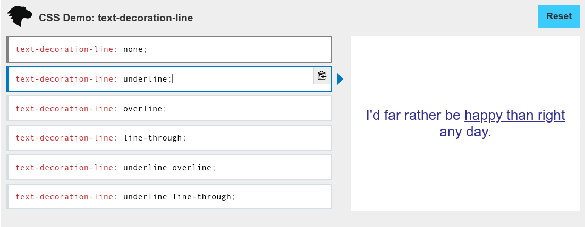
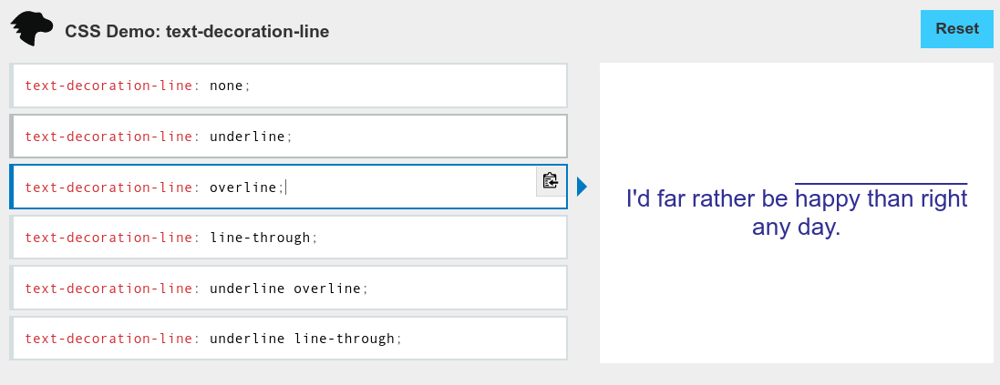
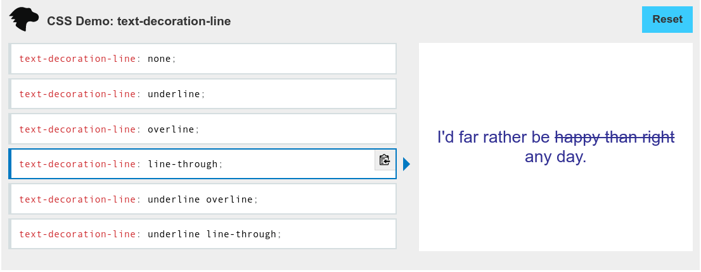
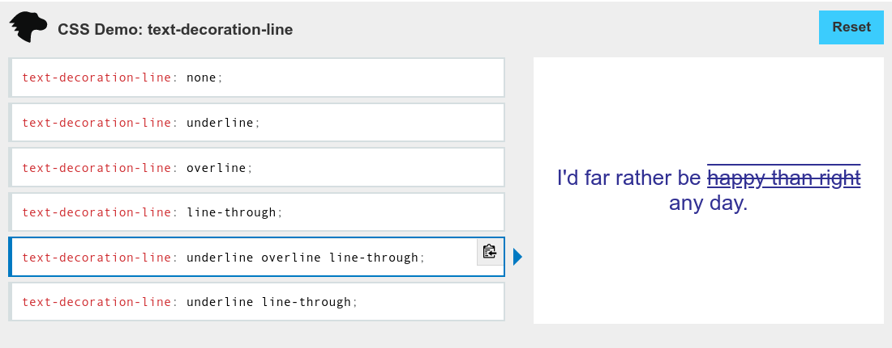

# @downwindcss/text-decoration

A [Tailwind CSS](https://tailwindcss.com/) Plugin for [text-decoration](https://developer.mozilla.org/en-US/docs/Web/CSS/text-decoration) utility.

This plugin is composable ([Composing the Uncompsable with CSS Variables](https://adamwathan.me/composing-the-uncomposable-with-css-variables/)) thus can add multiple [text-decoration-line](https://developer.mozilla.org/en-US/docs/Web/CSS/text-decoration-line) utitlies (to add under/overline and line-through together. Refer to the "Usage" sectrion below)

## Installation

```bash
npm install @downwindcss/text-decoration
# for Yarn users
yarn add @downwindcss/text-decoration
```

## Configuration

Add the plugin in `tailwind.config.js` in [Plugins section](https://tailwindcss.com/docs/configuration#plugins).

```js
// tailwind.config.js
module.exports = {
  plugins: [require('@downwindcss/text-decoration')],
};
```

## Utilities

## Usage

To enable `text-decoration` utilities, you need to add `.text-decoration` class.

By itself it doesn't apply any style similar to how built-in [Transform](https://tailwindcss.com/docs/transform) utility doesn't apply any transformations.

```html
<h2 class="text-decoration">Header</h2>
```

### text-decoration-line

Utilities for applying lines.  
MDN: [text-decoration-line](https://developer.mozilla.org/en-US/docs/Web/CSS/text-decoration-line)

Use Tailwind CSS's [no-underline](https://tailwindcss.com/docs/text-decoration#no-underline) to remove text decoration.

**ATTRIBUTION:** Screenshots on [text-decoration-line](https://developer.mozilla.org/en-US/docs/Web/CSS/text-decoration-line) by [Mozilla Contributrors](https://developer.mozilla.org/en-US/docs/MDN/About/contributors.txt) is licensed under [CC-BY-SA 2.5](https://creativecommons.org/licenses/by-sa/2.5/)

#### underline.

```html
<p>
  I'd far rather be
  <span class="text-decoration text-decoration-line-underline">
    happy than right
  </span>
  any day.
</p>
```



#### overline.

```html
<p>
  I'd far rather be
  <span class="text-decoration text-decoration-line-overline">
    happy than right
  </span>
  any day.
</p>
```



#### line-through.

```html
<p>
  I'd far rather be
  <span class="text-decoration text-decoration-line-through">
    happy than right
  </span>
  any day.
</p>
```



**NOTE**: It's not `text-decoration-line-line-through` even though CSS applied is `text-decoration-line: line-through;`

#### underline + overline + line-through

```html
<p>
  I'd far rather be
  <span
    class="text-decoration 
      decoration-line-overline 
      decoration-line-underline 
      decoration-line-through"
  >
    happy than right
  </span>
  any day.
</p>
```



### decoration-color

All Tailwind CSS colors and custom colors are available.

// Show tw color usage  
// add a custom color and show the usage

### decoration-style

### tdecoration-thickness

### Duplicate Utilities

Following `text-decoration` can be done with native [Tailwind CSS utilities](https://tailwindcss.com/docs/text-decoration) but also added in this plugin to enable composability.

1. underline: `text-decoration: underline;`
2. line-through: `text-decoration: line-through;`
3. no-underline: `text-decoration: none;`

## Resource

- Source: [downwindcss/text-decoration](https://github.com/downwindcss/text-decoration)
- NPM: https://www.npmjs.com/package/@downwindcss/text-decoration

## Context

Based on idea post in Tailwind CSS dicussion, https://github.com/tailwindlabs/tailwindcss/discussions/3749

This plugin provides missing Tailwind CSS `text-decoration*` properties as a plugin.

## Build

This project uses [PNPM](https://pnpm.io/)